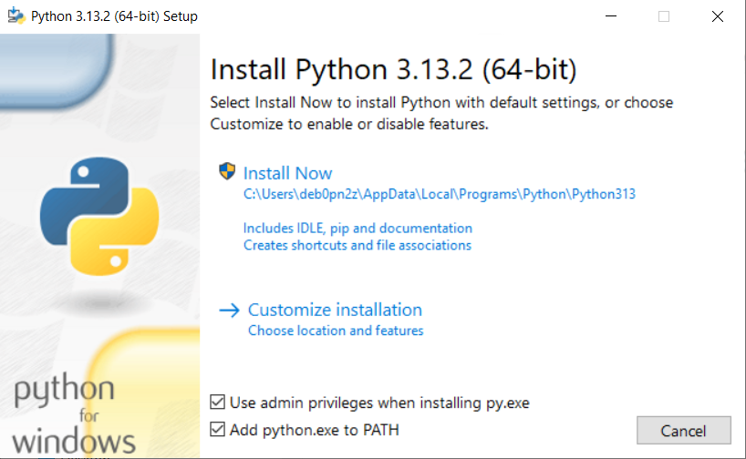
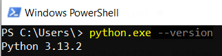
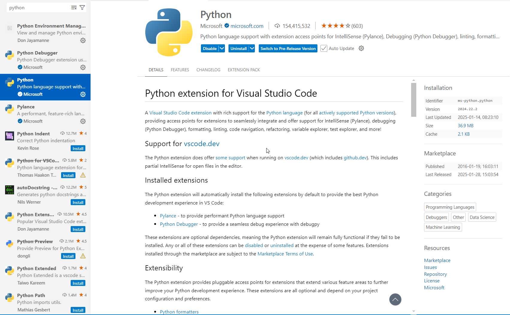

# Python

## Einrichtung der Python Entwicklungsumgebung

Als Entwicklungsumgebung kann *MS Visual Studio Code* (direkter Download aus dem Internet) oder *MS Visual Studio* (Unternehmensportal - kostenpflichtig, daher Abklärung mit Führungskraft nötig) verwendet werden.  

*Anmerkung:  
In diesem Skript wird ausschließlich auf die Nutzung von MS Visual Studio Code eingegangen!*

## I. Installation von Python 3.13.2

Man benötigt **lokale Adminrechte zur Installation** - diese sollten (Stand. 02.2025) mit dem Tool  

 *BeyondTrust Privilege Management*  

ohne weitere Maßnahmen möglich sein.  

**Hinweis:**  **Bei der Installation folgende Haken setzen** s. Bild:  




Zum **Testen der Installation** folgenden Befehl in einer *PowerShell* eingeben:  

```
python.exe --version
```

Es sollte folgende Ausgabe erscheinen:  



<div style="page-break-before: always;"></div>

## II. Visual Studio Code Einrichtung

**Installation**  
Die Installation von VS Code ist mit Standardeinstellungen möglich. Nach erfolgreicher Installation startet man das Programm und fügt benötigte Extensions hinzu.

**Extension(s)**

- *Python* Extension von Microsoft:  

    

## III. Einrichtung der Softwareverwaltung mit git

Git kann über das Unternehmensportal installiert werden.  

Zur Kontrolle, wie git konfiguriert ist, gibt man folgenden Befehl in eine PowerShell ein:  
    
    git config --global --edit

Daraufhin öffnet sich der Standard Editor und zeigt die Datei *.gitconfig* an.  
Dort muss ein Eintrag stehen, der folgende Informationen beinhaltet:  

    [user]
	name = <BENUTZERNAME>
	email = <BENTUZEREMAIL>@<DOMANE>

Alternativ kann diese Information auch folgendermaßen gesetzt werden: 

    git config --global user-name="BENUTZER"
    git config --global user-email="EMAIL"

Sollten diese Einstellungen nur für das aktuelle git-Repository gültig sein, so muss man in dessen Verzeichnis befinden und dort die beiden Befehle ohne *--global* ausführen.

## Grundlagen von Python

### 1. Variablen und Datentypen
 
**Beschreibung:**  
In Python sind Variablen Container für Datenwerte. Python unterstützt verschiedene Datentypen wie `int`, `float`, `str`, `list`, etc.

**Beispiel:**

```python
# Integer
x = 10

# Float
y = 10.5

# String
name = "Siemens"

# Liste
fruits = ["Apfel", "Banane", "Kirsche"]
```

**Übungsaufgabe A1**

Definiere eine Variable `z` mit dem Wert 20.0 und den Datentyp `float`. Gib die Variable aus.

<div style="page-break-before: always;"></div>

### 2. Kontrollstrukturen

**Beschreibung:**  
Kontrollstrukturen wie `if`, `else`, und Schleifen (`for`, `while`) steuern den Fluss des Programms.

**Beispiel:**

```python
# If-Else (! Verzweigung !)
a = 5
if a > 0:
    print("a ist positiv")
else:
    print("a ist nicht positiv")

# For-Schleife
for fruit in fruits:
    print(fruit)

# While-Schleife
count = 0
while count < 5:
    print(count)
    count += 1
```

**Übungsaufgabe A2**

Implementiere eine `for`-Schleife, die die Zahlen von 1 bis 10 ausgibt.

<div style="page-break-before: always;"></div>

## Objektorientierte Programmierung in Python

### 1. Klassen und Objekte

**Beschreibung:**  
In der OOP sind Klassen Baupläne für Objekte. Sie definieren die Attribute und Methoden, die ein Objekt haben kann.

**Beispiel:**

```python
class Car:
    def __init__(self, brand, model):
        self.brand = brand
        self.model = model

    def display_info(self):
        print(f"Marke: {self.brand}, Modell: {self.model}")

# Objekt erstellen
my_car = Car("BMW", "X3")
my_car.display_info()
```

**Übungsaufgabe A3**

Erstelle eine Klasse `Student` mit den Attributen `name` und `studiengang`. Füge eine Methode `display_info` hinzu, um die Informationen auszugeben.

<div style="page-break-before: always;"></div>

### 2. Vererbung

**Beschreibung:**  
Vererbung ermöglicht es einer Klasse, Attribute und Methoden von einer anderen Klasse zu erben.

**Beispiel:**

```python
# Basisklasse
class Animal:
    def speak(self):
        print("Das Tier macht ein Geräusch")

# Abgeleitete Klasse
class Dog(Animal):
    def speak(self):
        print("Der Hund bellt")

# Objekt erstellen
my_dog = Dog()
my_dog.speak()
```

**Übungsaufgabe A4**

Erstelle eine Klasse `Bird`, die von `Animal` erbt und die Methode `speak` überschreibt, um "Der Vogel zwitschert" auszugeben.  
  

<div style="page-break-before: always;"></div>

## Lösungen

**Musterlösung A1**

```python
z = 20.0
print(z)
```

**Musterlösung A2**

```python
for i in range(1, 11):
    print(i)
```

**Musterlösung A3**

```python
class Student:
    def __init__(self, name, studiengang):
        self.name = name
        self.studiengang = studiengang

    def display_info(self):
        print(f"Name: {self.name}, Studiengang: {self.studiengang}")

# Objekt erstellen
student = Student("Anna", "Informatik")
student.display_info()
```

**Musterlösung A4**

```python
class Bird(Animal):
    def speak(self):
        print("Der Vogel zwitschert")

# Objekt erstellen
my_bird = Bird()
my_bird.speak()
```